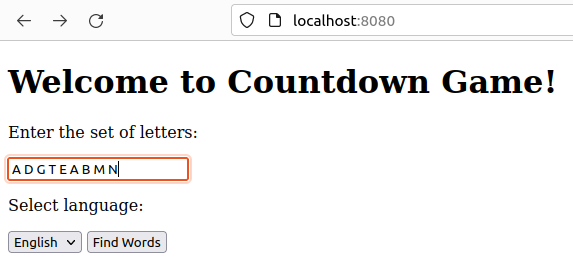
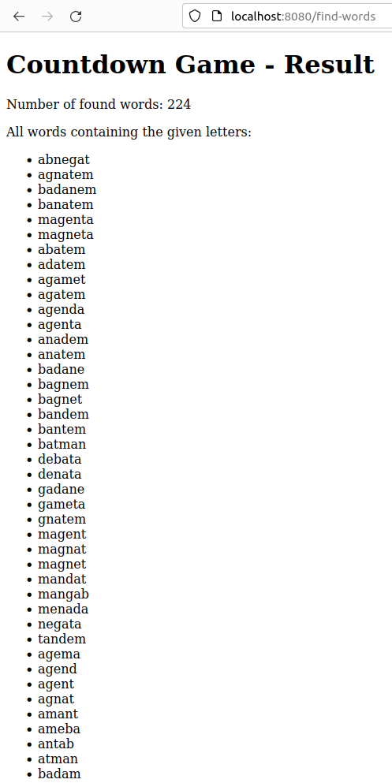
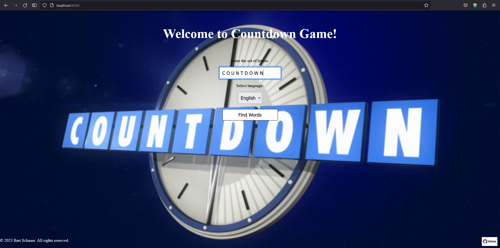
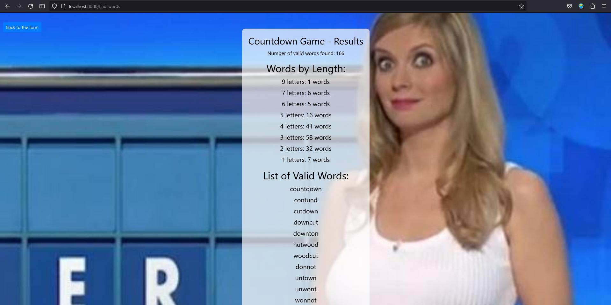

# Countdown Game

Welcome to Countdown Game, a web application based on Spring Boot that helps you find valid words from a given set of letters, inspired by the famous British TV show.

## Table of Contents

- [How to Use](#how-to-use)
- [Countdown Game Show](#countdown-game-show)
- [Countdown Game Show Information](#countdown-game-show-information)
- [Screenshots](#screenshots)
- [How It Works](#how-it-works)
- [Technologies Used](#technologies-used)
- [Author](#author)

## How to Use

1. Run the application.

2. Open your web browser and navigate to `http://localhost:8080`.

3. Choose the language (Polish or English) from the dropdown menu.

4. Enter the set of letters you want to use for finding valid words.

5. Click the "Find Words" button.

6. The application will display a list of valid words that can be formed using the given letters.

7. The total number of found words will be shown at the top of the result.

8. Additionally, the result will be saved to a txt file (`words_with_given_letters.txt`) in the project directory.

## Countdown Game Show

The Countdown Game is inspired by the famous British TV show "Countdown." In the show, contestants are given a set of random letters, and they have to find the longest word they can create using those letters. The game is known for its challenging and entertaining word puzzles.

## Countdown Game Show Information

- **Official Website:** [channel4.com/programmes/countdown](https://www.channel4.com/programmes/countdown)
- **Description:** Countdown is a British game show involving word and number tasks that began airing in November 1982. It is broadcast on Channel 4 and is currently presented by Colin Murray, assisted by Rachel Riley with resident lexicographer Susie Dent.

## Screenshots

## How It Works

The application reads a dictionary of words from either `polishdictionary.txt` or `englishdictionary.txt`, depending on the chosen language. It then finds all the valid words that can be formed using the given set of letters. The words are sorted from the longest to the shortest, and in case of the same length, they are sorted alphabetically. Finally, the list of valid words and the total count are displayed on the web page, and the result is saved to a txt file for future reference.

## Technologies Used

- Java 11
- Spring Boot 2.7.14
- Thymeleaf for templating
- Maven for project management
- HTML/CSS

## Author

Bart Schauer

github repository:
https://github.com/bart7801/CountdownGame

temporary website where you can see and check the application:
https://bartschauer.alwaysdata.net/